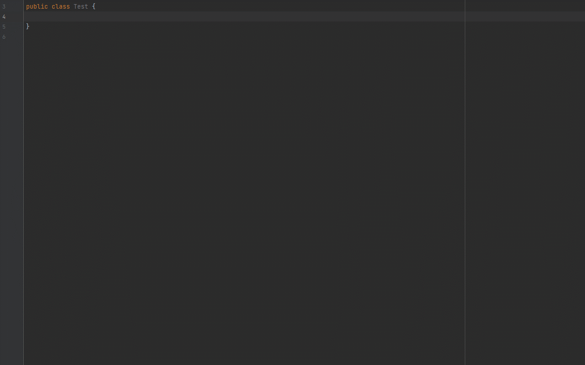
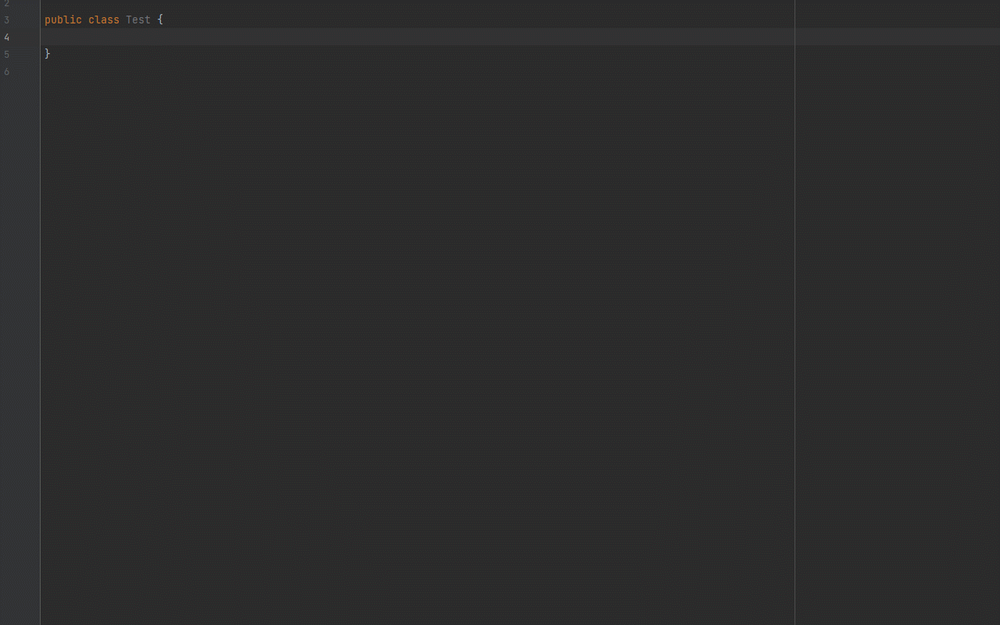

# JvmFieldGenerator

<!-- Plugin description -->
JvmFieldGenerator generates Java/Kotlin class fields from plain-text definitions.
<!-- Plugin description end -->

JvmFieldGenerator is a plugin for quickly generating Java/Kotlin class fields from text definitions.
JvmFieldGenerator 是一个可以根据字符串内容快速生成 Java/Kotlin 类字段的插件。

> 在日常开发的过程中，常常会根据接口文档去定义一些JavaBean，而接口文档的请求和响应相关信息，在大部分情况下都是使用表格的形式列出相关的字段信息，每次无脑式的对着文档的字段信息去定义对应的JavaBean就略显无聊。
> 如果这时我们使用了 **JvmFieldGenerator** 插件，就可以快速根据定义的字段信息来生成 Java/Kotlin 对象中的字段信息。

## Installation / 安装
- Using the IDE built-in plugin system on Windows:
  - <kbd>File</kbd> > <kbd>Settings</kbd> > <kbd>Plugins</kbd> > <kbd>Marketplace</kbd> > <kbd>Search for "JvmFieldGenerator"</kbd> > <kbd>Install</kbd>
- Using the IDE built-in plugin system on macOS:
  - <kbd>Preferences</kbd> > <kbd>Plugins</kbd> > <kbd>Marketplace</kbd> > <kbd>Search for "JvmFieldGenerator"</kbd> > <kbd>Install</kbd>
- Manual installation:
  - Download the [latest release](https://github.com/jenly1314/JvmFieldGenerator/releases/latest), then install it via <kbd>Settings/Preferences</kbd> > <kbd>Plugins</kbd> > <kbd>Install plugin from disk...</kbd>
  - [Get from JetBrains Marketplace](https://plugins.jetbrains.com/plugin/19258)
  
Restart IDE.

## Features / 主要功能
* 快速生成 **Java/Kotlin** 类字段
* 支持 **Java/Kotlin** 自定义配置
* 支持 **Gson/Moshi/Jackson/FastJson/Kotlin Serialization** 等各种注解配置

## Usage / 使用

### Examples / 示例
#### Generate fields from input text / 根据输入内容生成字段

#### Quickly generate fields from copied text / 根据复制内容快速生成字段

## 相关推荐

- [WordPOI](https://github.com/jenly1314/WordPOI) 一个将Word接口文档转换成JavaBean的工具库。

## 版本日志

#### v2.0.0 ：待发布
- 项目更名为 **JvmFieldGenerator**
- 项目核心部分已重构，现在支持 Java/Kotlin 类字段生成
- 优化交互细节

#### v1.1.0 ：2022-7-8
- 支持字段类型转换配置

#### v1.0.0 ：2022-5-30
- JavaFieldGenerator初始版本

---

