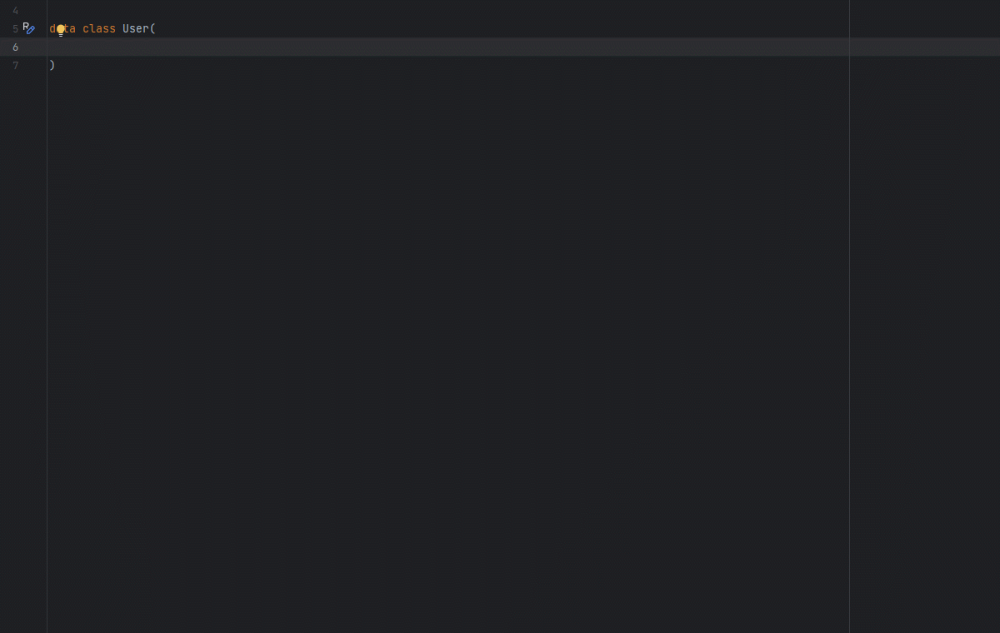
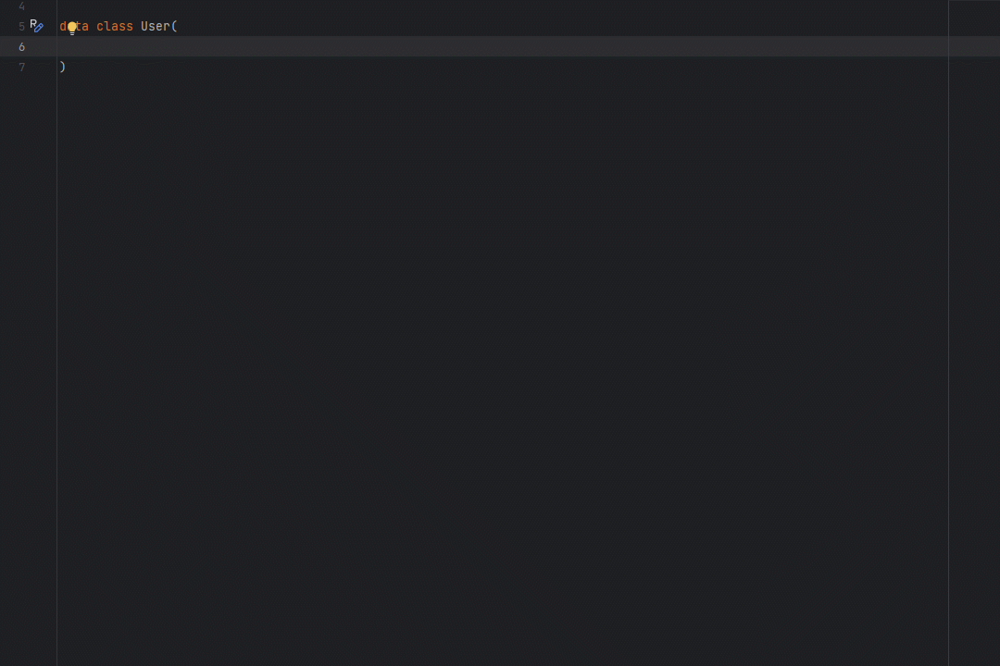

# JvmFieldGenerator


[](https://github.com/jenly1314/JvmFieldGenerator/releases/latest)
[](https://github.com/jenly1314/JvmFieldGenerator/actions/workflows/build.yml)
[](https://opensource.org/licenses/apache-2-0)

<!-- Plugin description -->
JvmFieldGenerator is a plugin for quickly generating Java/Kotlin class fields from text definitions.
<!-- Plugin description end -->

JvmFieldGenerator 是一个可以根据字符串内容快速生成 Java/Kotlin 类字段的插件。

> 在日常开发的过程中，常常会根据接口文档去定义一些JavaBean，而接口文档的请求和响应相关信息，在大部分情况下都是使用表格的形式列出相关的字段信息，每次无脑式的对着文档的字段信息去定义对应的JavaBean就略显无聊。
> 如果这时我们使用了 **JvmFieldGenerator** 插件，就可以快速根据定义的字段信息来生成 Java/Kotlin 对象中的字段信息。


## Installation / 安装
- Using the IDE built-in plugin system on Windows:
  - <kbd>File</kbd> > <kbd>Settings</kbd> > <kbd>Plugins</kbd> > <kbd>Marketplace</kbd> > <kbd>Search for "JvmFieldGenerator"</kbd> > <kbd>Install</kbd>
- Using the IDE built-in plugin system on macOS:
  - <kbd>Preferences</kbd> > <kbd>Plugins</kbd> > <kbd>Marketplace</kbd> > <kbd>Search for "JvmFieldGenerator"</kbd> > <kbd>Install</kbd>
- Manual installation:
  - Download the [latest release](https://github.com/jenly1314/JvmFieldGenerator/releases/latest), then install it via <kbd>Settings/Preferences</kbd> > <kbd>Plugins</kbd> > <kbd>Install plugin from disk...</kbd>
  - [Get from JetBrains Marketplace](https://plugins.jetbrains.com/plugin/31452)

Restart IDE.

## Features / 主要功能
* 快速生成 **Java/Kotlin** 类字段
* 支持 **Java/Kotlin** 自定义配置
* 支持 **Gson/Moshi/Jackson/FastJson/Kotlin Serialization** 等各种注解配置

## Usage / 使用

- `Generate Fields`: right-click a class/package and generate fields from custom input.
- `Generate Fields Quickly`: use copied text directly from the editor popup menu.
- Shortcut for quick action: <kbd>Ctrl</kbd> + <kbd>Shift</kbd> + <kbd>G</kbd>.

- `Generate Fields`：在类或包上右键，通过自定义输入生成字段。
- `Generate Fields Quickly`：在编辑器右键菜单中直接基于剪贴板内容生成字段。
- 快捷生成快捷键：<kbd>Ctrl</kbd> + <kbd>Shift</kbd> + <kbd>G</kbd>。

#### Text format / 文本格式

- Supports table-like text copied from API docs, Excel, or online documents.
- Use a single Tab character as the column separator.

- 支持从接口文档、Excel 或在线文档复制的表格形式文本。
- 列与列之间请使用单个 Tab 字符分隔。

```text
fieldName   type
id  String
name    String
age Int
```

### Examples / 示例
#### Generate fields from input text / 根据输入内容生成字段


#### Generate fields quickly from copied text / 根据复制内容快速生成字段


## 相关推荐

- [WordPOI](https://github.com/jenly1314/WordPOI) 一个将Word接口文档转换成JavaBean的工具库。

## 版本日志

#### v2.1.0 ：2026-5-5
- UI微调
- 优化细节


#### [查看更多版本日志](CHANGELOG.md)

---


