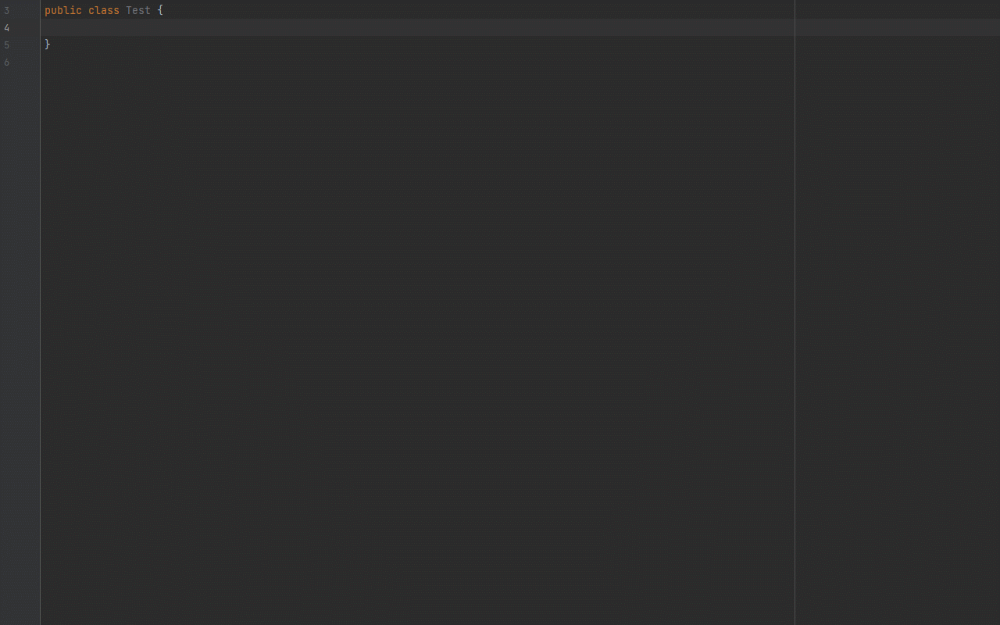

# Java Field Plugin

<!-- Plugin description -->
JavaFieldPlugin This is a plugin you can generate Java field from String.
<!-- Plugin description end -->

JavaFieldPlugin 是一个可以根据字符串内容快速生成Java字段的插件。

> 在日常开发的过程中，常常会根据接口文档去定义一些JavaBean，而接口文档的请求和响应相关信息，在大部分情况下都是使用表格的形式列出相关的字段信息，每次无脑式的对着文档的字段信息去定义对应的JavaBean就略显无聊。
> 如果这时我们使用了 **JavaFieldPlugin** 插件，就可以快速根据定义的字段信息来生成Java对象中的字段信息。

## 示例
### 根据输入的内容生成Java字段

### 根据复制的内容快速生成Java字段

## 相关推荐

#### [WordPOI](https://github.com/jenly1314/WordPOI) 一个将Word接口文档转换成JavaBean的工具库。

## 更新说明
#### v1.0.0 ：2022-5-30
*  JavaFieldPlugin初始版本

## 赞赏
如果您喜欢JavaFieldPlugin，或感觉JavaFieldPlugin帮助到了您，可以点右上角“Star”支持一下，您的支持就是我的动力，谢谢 :smiley:

您也可以扫描下面的二维码，请作者喝杯咖啡 :coffee:
    

        
        
        
        
    

## 关于我
   Name: <a title="关于作者" href="https://about.me/jenly1314" target="_blank">Jenly</a>

   Email: <a title="欢迎邮件与我交流" href="mailto:jenly1314@gmail.com" target="_blank">jenly1314#gmail.com</a> / <a title="给我发邮件" href="mailto:jenly1314@vip.qq.com" target="_blank">jenly1314#vip.qq.com</a>

   CSDN: <a title="CSDN博客" href="http://blog.csdn.net/jenly121" target="_blank">jenly121</a>

   博客园: <a title="博客园" href="https://www.cnblogs.com/jenly" target="_blank">jenly</a>

   Github: <a title="Github开源项目" href="https://github.com/jenly1314" target="_blank">jenly1314</a>

   加入QQ群: <a title="点击加入QQ群" href="http://shang.qq.com/wpa/qunwpa?idkey=8fcc6a2f88552ea44b1411582c94fd124f7bb3ec227e2a400dbbfaad3dc2f5ad" target="_blank">20867961</a>
   

       
       
   

