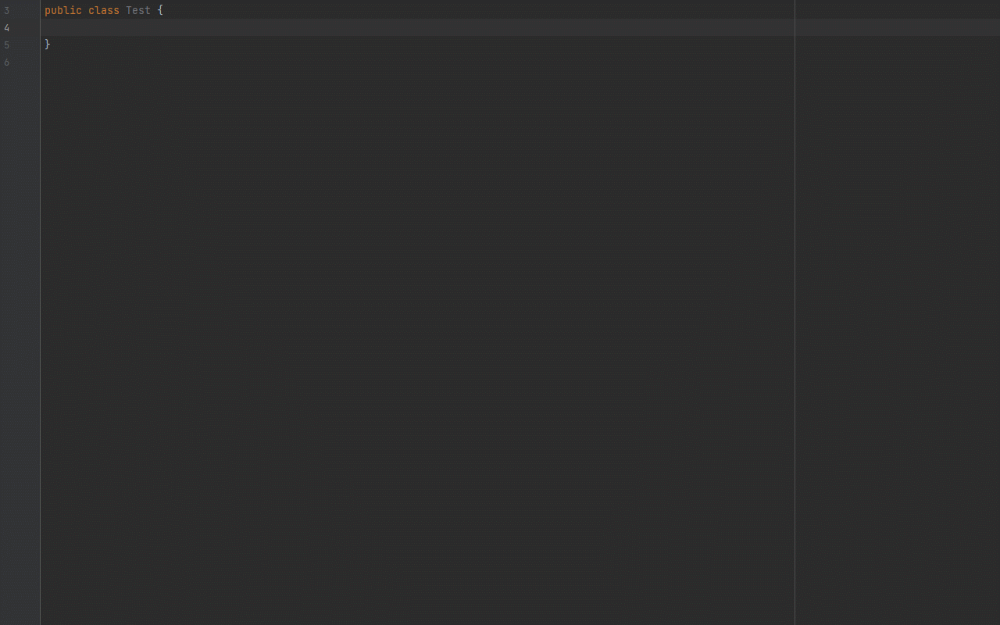

# JavaFieldGenerator


[](https://raw.githubusercontent.com/jenly1314/JavaFieldGenerator/master/release/JavaFieldGenerator-1.1.0.zip)
[](https://opensource.org/licenses/apache-2-0)


<!-- Plugin description -->
JavaFieldGenerator This is a plugin you can generate Java field from String.
<!-- Plugin description end -->

JavaFieldGenerator 是一个可以根据字符串内容快速生成Java字段的插件。

> 在日常开发的过程中，常常会根据接口文档去定义一些JavaBean，而接口文档的请求和响应相关信息，在大部分情况下都是使用表格的形式列出相关的字段信息，每次无脑式的对着文档的字段信息去定义对应的JavaBean就略显无聊。
> 如果这时我们使用了 **JavaFieldGenerator** 插件，就可以快速根据定义的字段信息来生成Java对象中的字段信息。


## Install
- Using IDE built-in plugin system on Windows:
  - <kbd>File</kbd> > <kbd>Settings</kbd> > <kbd>Plugins</kbd> > <kbd>Browse repositories...</kbd> > <kbd>Search for "JavaFieldGenerator"</kbd> > <kbd>Install Plugin</kbd>
- Using IDE built-in plugin system on MacOs:
  - <kbd>Preferences</kbd> > <kbd>Settings</kbd> > <kbd>Plugins</kbd> > <kbd>Browse repositories...</kbd> > <kbd>Search for "JavaFieldGenerator"</kbd> > <kbd>Install Plugin</kbd>
- Manually:
  - Download the [latest release](https://raw.githubusercontent.com/jenly1314/JavaFieldGenerator/master/release/JavaFieldGenerator-1.1.0.zip) and install it manually using <kbd>Preferences</kbd> > <kbd>Plugins</kbd> > <kbd>Install plugin from disk...</kbd>
  - [Get from JetBrains Marketplace](https://plugins.jetbrains.com/plugin/19258)
  
Restart IDE.

## 主要功能
* 快速生成 **Java** 字段
* 快速生成 **Getter** 和 **Setter** 方法
* 快速生成 **toString** 方法

## 使用

### 字段类型配置说明

当文档上定义的字段类型并非Java的基本类型或对象时，这时就需要用到字段类型转换配置，通过配置来动态将文档上定义的类型转换成我们期望的Java字段类型。

在 **Java Field** 的 **Setting** 中提供了字段类型配置，你可以根据自己的需要来修改配置。

* 配置格式：**{未转换前的字段类型}** = **{转换成Java后的字段类型}**

* 配置示例如下：
```
varchar=String
tinytext=String
text=String
string=String
bool=boolean
integer=Integer

```

### 示例
#### 根据输入的内容生成Java字段


#### 根据复制的内容快速生成Java字段


## 相关推荐

- [WordPOI](https://github.com/jenly1314/WordPOI) 一个将Word接口文档转换成JavaBean的工具库。

## 版本日志

#### v1.1.0 ：2022-7-8
*  支持字段类型转换配置

#### v1.0.0 ：2022-5-30
*  JavaFieldGenerator初始版本

---


